Nori Renderer
=====================================
**Kehan Xu ([LinkedIn](https://www.linkedin.com/in/kehan-xu-356139159/) | [Github](https://github.com/Fiona730) | [Personal Website](https://fiona730.github.io) | [Email](mailto:fiona0730pku@gmail.com)), Zijun Hui ([LinkedIn](https://www.linkedin.com/in/zijun-hui-498336153/) | [Github](https://github.com/ZijunH))**

Tested on: Mac OS (Version 12.3), Linux (Ubuntu 20.04)

This is my own offline physically-based ray tracer. To achieve photorealism, the program simulates light transport in a modeled scene based on unbiased Monte Carlo integration of the [rendering equation](https://en.wikipedia.org/wiki/Rendering_equation). My ray tracer supports a wide range of rendering-related techniques, including path tracing with MIS, volume rendering, spectral rendering and photon mapping. The goal of writing this renderer is to gain hands-on experience in implementing state-of-the-art algorithms that are adopted by production renderers.

My renderer is written in C++. It is first created in the [computer graphics course](https://cgl.ethz.ch/teaching/cg22/home.php) at ETH Zurich, and added with more functionalities afterwards.

**Note: Due to permission issue from graphics course staff, the source code cannot be made public for now. If you are interested in discussing the details of implementation, please email me.**

## Table of Contents

[Nori Framework](#nori-framework)

[Feature Overview](#feature-overview)
* [Path Tracing with Multiple Importance Sampling](#path-mis)
* [Various Types of Light Source](#light-source)
* [Environment Map](#environment-map)
* [Depth of Field](#depth-of-field)
* [Microfacet BSDF](#microfacet-bsdf)
* [Volume Rendering](#volume-rendering)
* [Spectral Rendering](#spectral-rendering)
* [Photon Mapping](#photon-mapping)

[Gallery](#gallery)

[Install and Build Instructions](#install-and-build-instrustions)

[Third-Party Credits](#third-party-credits)

[TODOs](#todos)

<a name="nori-framework"/> 

## Nori Framework

My renderer is built upon the awesome educational ray tracing framework [Nori 2](https://github.com/wjakob/nori) by [Wenzel Jakob](https://rgl.epfl.ch/people/wjakob/) and [his team](https://rgl.epfl.ch/people).

The framework is written in C++ and runs on Windows, Linux, and Mac OS. It comes with basic functionalities that facilitate rendering algorithm development and are otherwise tedious to implement from scratch, including but not limited to:
* A simple GUI to watch images as they render
* An XML-based scene file loader
* Support for saving output as [OpenEXR files](https://github.com/AcademySoftwareFoundation/openexr)
* Ray-triangle intersection
* An optimized [bounding volume hierarchy builder](https://dl.acm.org/doi/10.1109/RT.2007.4342588)

You can refer to [Nori website](https://wjakob.github.io/nori/) for more details.

<a name="feature-overview"/> 

## Feature Overview

<a name="path-mis"/> 

#### Path Tracing with Multiple Importance Sampling

At each surface intersection, naive [path tracing](https://en.wikipedia.org/wiki/Path_tracing) algorithm determines the bounced ray direction according to material properties, or bidirectional scattering distribution function ([BSDF](https://en.wikipedia.org/wiki/Bidirectional_scattering_distribution_function)). Sometimes a better strategy to form valid light paths (i.e. paths starting from camera that reaches light) is to consider known light locations in the scene, and shoot ray towards some position on any of light sources from the current intersection point. An even better strategy, so called multiple importance sampling (MIS), is to combine these two schemes. [Veach proved that balance heuristics gives near-optimal combine weights.](https://graphics.stanford.edu/courses/cs348b-03/papers/veach-chapter9.pdf)

Path tracing with MIS (and Russian Roulette) is the widely-used baseline to form an efficient path tracer.

| [BSDF Sampling](scene/xml/cbox_path_mats_512spp.xml) | [Multiple Importance Sampling](scene/xml/cbox_path_mis_512spp.xml)  |
| ----------------------- | ------------------- |
|  |  |

<i>Both rendered with 512 spp, MIS shows much less noise than BSDF sampling.</i>

<a name="light-source"/> 

#### Various Types of Light Source
  * Finite
    * Area Light
    * Point Light
    * Spotlight
  * Infinite
    * Directional Light
    * Environment Map Light (see next section)

| [Area Light](scene/xml/cbox_path_mis_512spp.xml) | [Point Light](scene/xml/cbox_point_light_512spp.xml)  |  [Spotlight](scene/xml/cbox_spot_light_512spp.xml) | [Directional Light](scene/xml/cbox_directional_light_512spp.xml)  |
| ----------------------- | ------------------- | ----------------------- | ------------------- | 
|  | 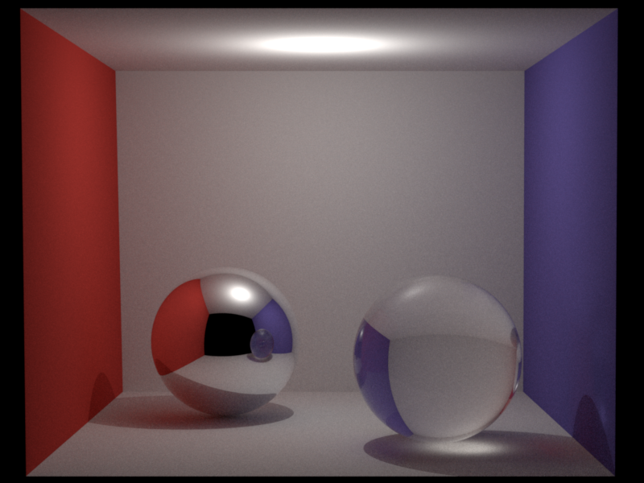 | 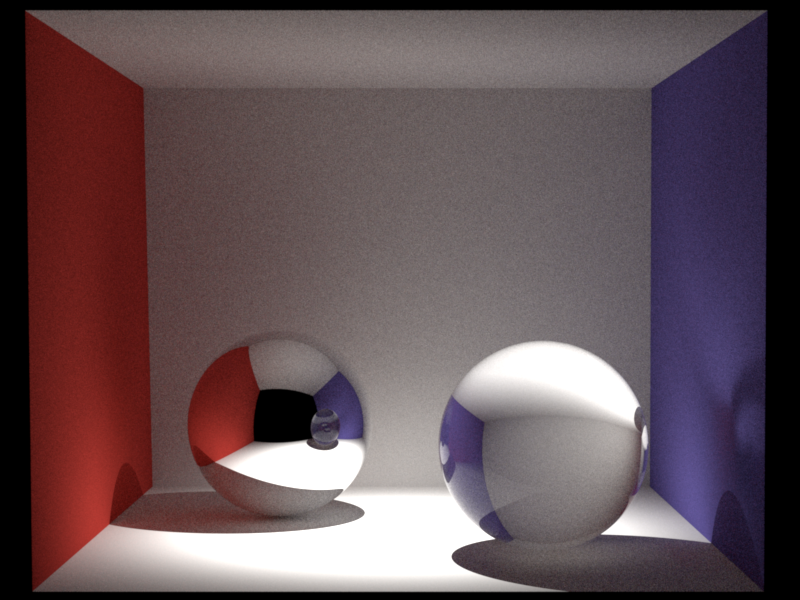 | 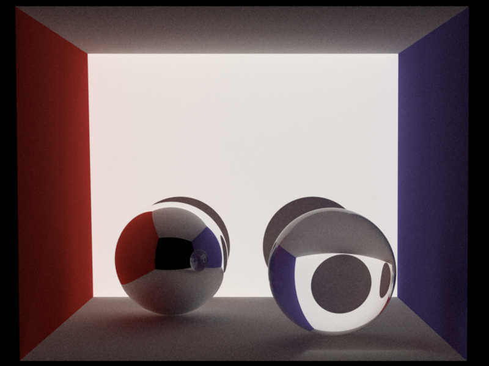 |

<a name="environment-map"/> 

#### Environment Map
Environment map forms a sphere around the whole scene and emits light. The program supports user parameters to rotate the sphere in X/Y/Z directions.

Environment map is sampled according to pixel brightness (i.e. the probability of choosing a pixel as the endpoint of a light path is proportional to its brightness). This approach is necessary, considering that sun is usually included in textures for natural environment; pixels occupied by the sun are orders of magnitudes brighter than others. While all environment map pixels emit light, most of them lit objects dimly as the indirect lighting from surrounding environment; on the other hand, the sun form a prominent light source in the scene (see examples below). Given the extreme brightness of the sun, fireflies would fill the rendering if we sample each pixel with equal probability.

[**Scene File**](scene/xml/scene/xml/envmap_4balls_512spp.xml)

| No Rotation | Rotate by 180 Degrees around Y Axis |
| ----------------------- | ------------------- |
| 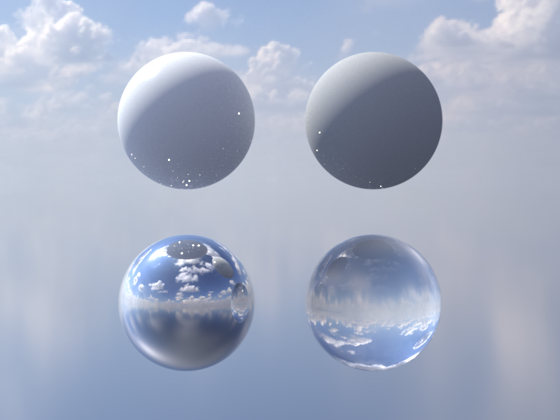 | 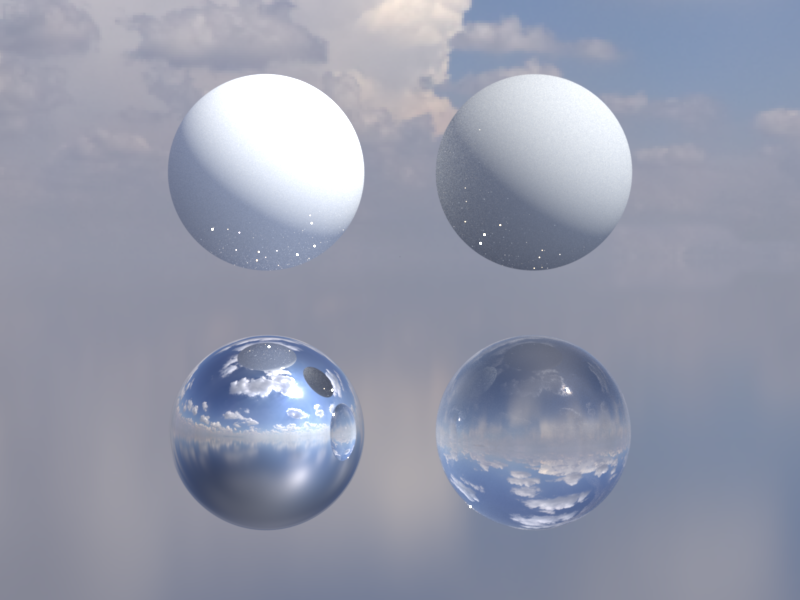 |

<i>Four spheres (diffuse, microfacet, mirror, dielectric) lit by the same environment map with different rotations. Notice how the shadow boundary changes corresponding to the position of sun.  Note: fireflies in the images are caused by the hard-to-sample specular light paths through mirror and dielectric spheres, not by bad sampling of the environment map.</i>

| [Bunny Under the Sun](scene/xml/envmap_bunny_512spp.xml)|
| ----------------------- |
| 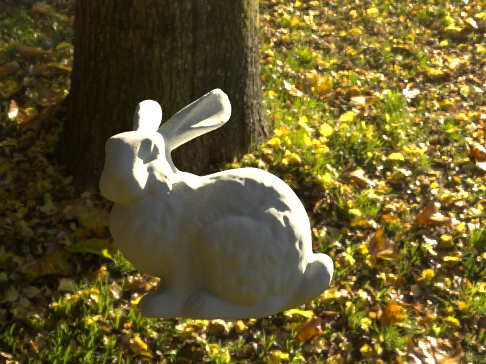 |

<a name="depth-of-field"/> 

#### Depth of Field
Depth-of-Field effect is achieved by replacing the pinhole camera model with lens. Given focal length and aperture size parameters, we are able to simulate camera rays that pass through random points on the lens. Focal length determines how far objects must be from the camera to be in focus. Aperture size determines how blurry objects that are out of focus will appear. If aperture is set to 0, the image won't have any DOF effects.

Currently, the shape of aperture is a square / circle. An interesting and straightforward extension would be to replace it with more complex shapes such as star, by stochastically sampling a mask image. This would lead to pleasing artistic effects :)

[**Scene File**](scene/xml/cbox_DOF_128spp.xml)

| F = 4.5  | F = 5.0 | F = 6.0 |
| ----------------------- | ------------------- | ----------------------- |
| 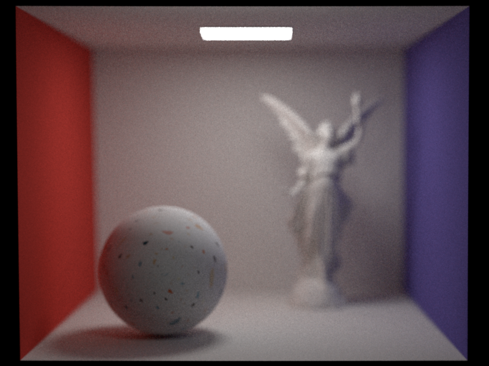 | 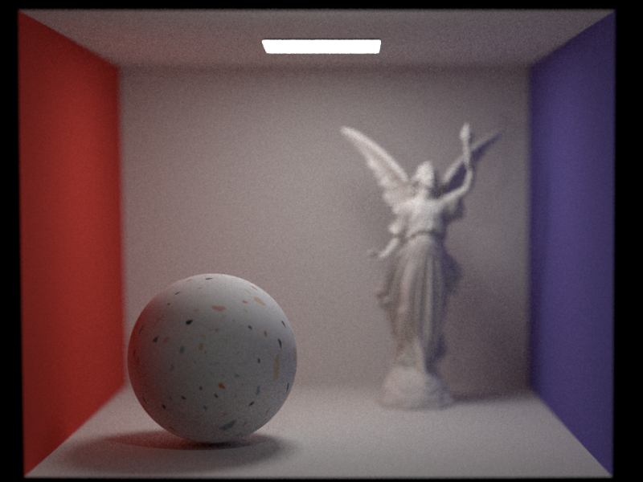 | 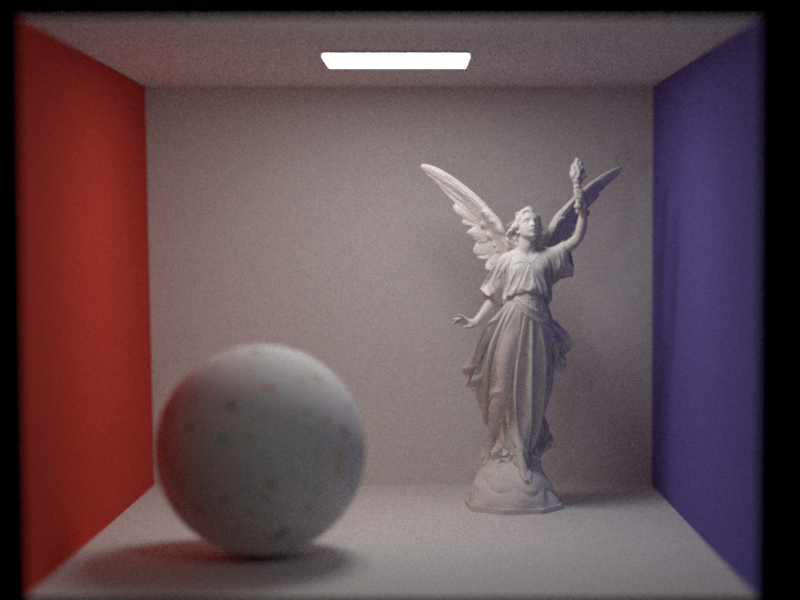 |

<i>Varying focal length. Aperture = 0.15.</i>

| A = 0  | A = 0.05 | A = 0.15 | A = 0.3 |
| ----------------------- | ------------------- | ----------------------- | ------------------- |
|  | 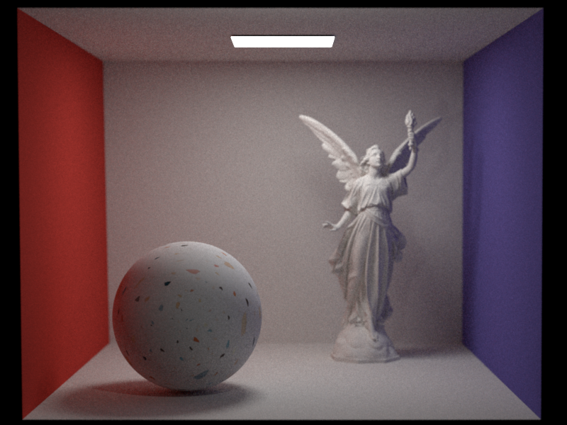 |  | 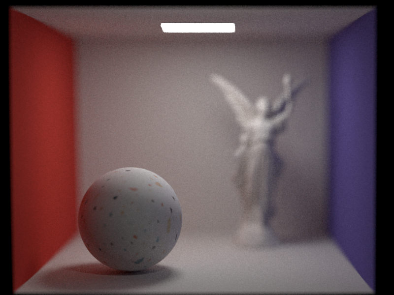 |

<i>Varying aperture. Focal length = 5.0.</i>

<a name="microfacet-bsdf"/> 

#### Microfacet BSDF
Simple BSDFs such as diffuse, mirror and dielectric only represents a small subset of materials existing in nature. [Microfacet BRDF](https://www.pbr-book.org/3ed-2018/Reflection_Models/Microfacet_Models) models surface as a collection of microfacets where each microfacet perfectly reflects incident light, and its formula describes the statistical distribution of facets. Microfacet BRDF is more or less physically-based and can represent a broader range of materials, with a tunable parameter for roughness.

Microfacet BRDF consists of three terms: the Fresnel term (F), the normal distribution function (D), the shadowing-masking term (G). F term describes the ratio between reflected and transmitted light using the [Fresnel Law](https://en.wikipedia.org/wiki/Fresnel_equations). D term expresses the distribution of microfacets through PDF of the facet-normals. G term considers the portion of incident light blocked by nearby microfacets from light to surface and surface to eye.

Beckmann and GGX are two different means of modeling D and G term. According to [this post](https://arnold-rendering.com/2016/02/06/ggx-microfacet-distribution/) and [this post](https://blender.stackexchange.com/questions/40586/what-do-glossy-distribution-models-do), GGX has a sharper peak and a larger tail than Beckmann; Beckmann is better for glossy materials, while GGX is suitable for rough materials. Most of the production renderers use GGX microfacet BRDF / BSDF models nowadays.

[**Scene File**](scene/xml/material_balls_microfacet_512spp.xml)

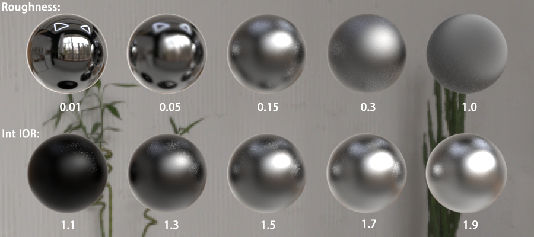

<i>Microfacet BRDF with Beckmann model. Spheres in the first row has varying roughness with interior index of refraction (IOR) = 1.5; spheres in the second row has varying interior IOR with roughness = 0.15.</i>

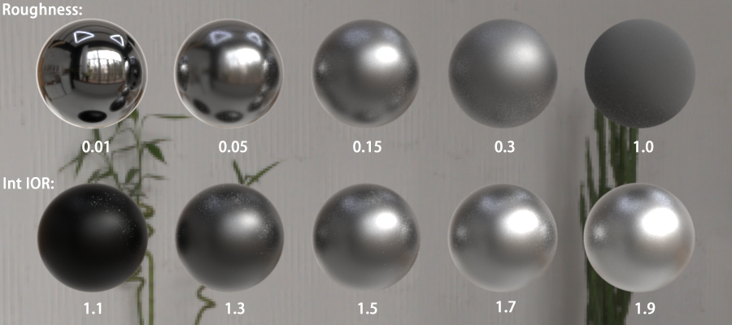

<i>Microfacet BRDF with GGX model. All other parameters are the same as above.</i>

When it comes to sample the BRDF, [a straightforward way](https://agraphicsguy.wordpress.com/2015/11/01/sampling-microfacet-brdf/) to sample Beckmann / GGX distribution is to first sample the half-vector (i.e. normal of the microfacet), then mirror the incident direction towards the half-vector to obtain the outgoing direction. As this only importance sample partial terms of BRDF, a better way of sampling exists for GGX model: [visible normal sampling](https://jcgt.org/published/0007/04/01/). All these sampling methods are implemented in my renderer and compared under the same setting.

<!--
[**Scene File**](scene/xml/cbox_microfacet_128spp.xml)

| BeckMann  | GGX | GGX + Visible Normal Sampling |
| ----------------------- | ------------------- | ----------------------- |
|  | 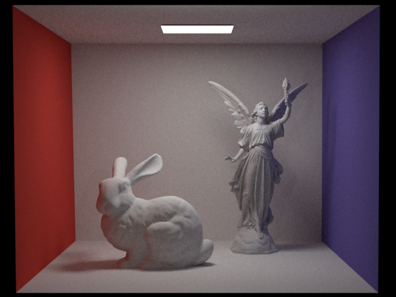 | 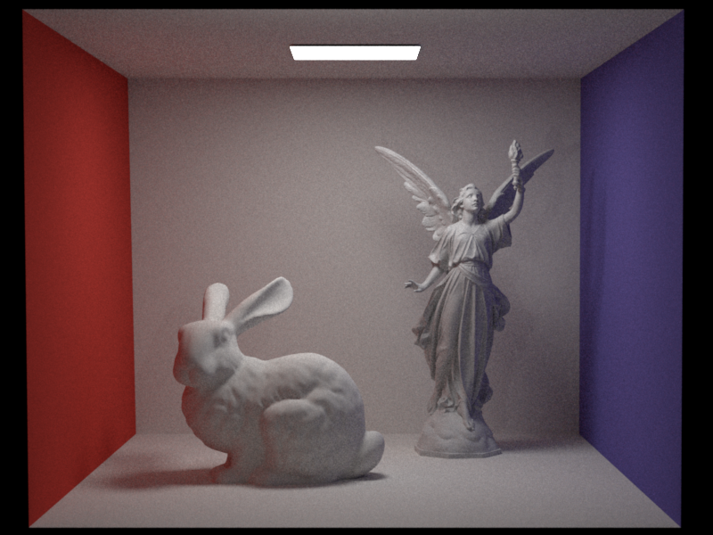 |
|  | 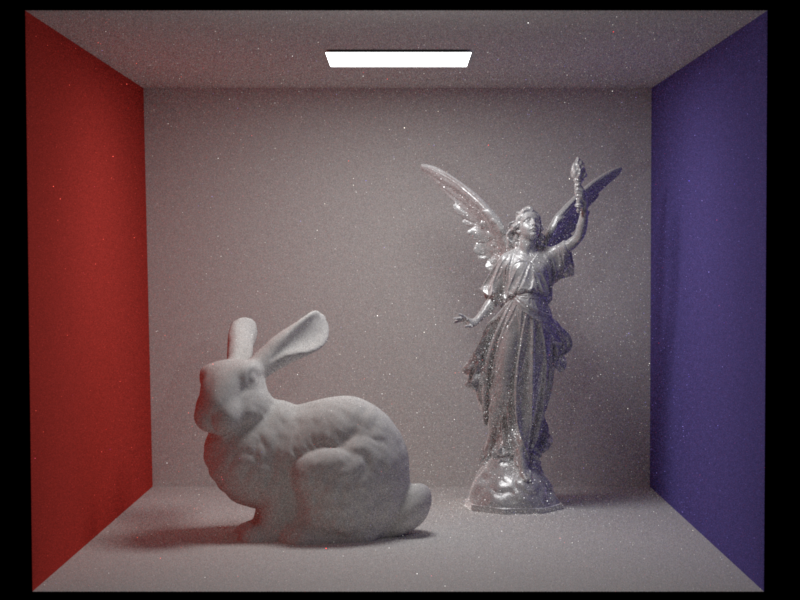 | 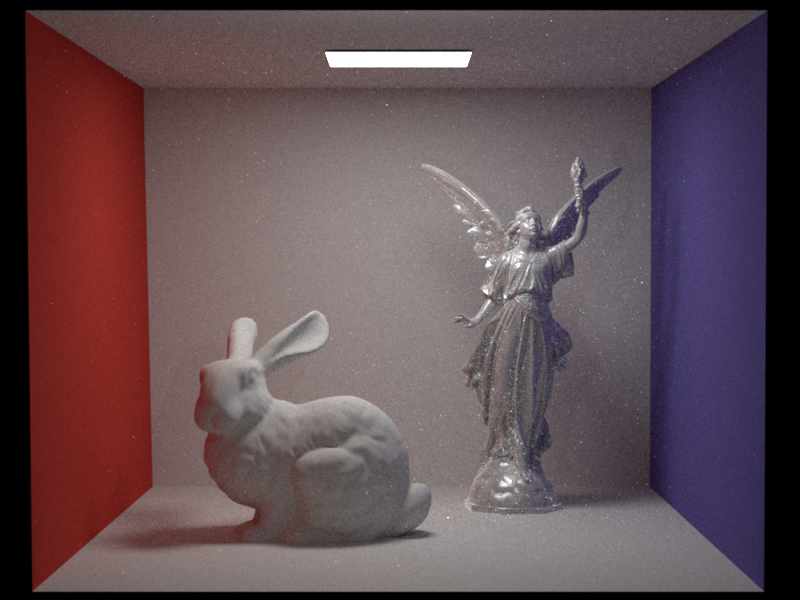 |

<i>Lucy (the statue) with microfacet BRDF, applying different models and sampling method.  Roughness is 0.5 / 0.1 for the top / bottom row. Bunny is diffuse for comparison.</i>

!!-->

[**Scene File**](scene/xml/envmap_microfacet_sampling_128spp.xml)

| BeckMann  | GGX | GGX + Visible Normal Sampling |
| ----------------------- | ------------------- | ----------------------- |
| 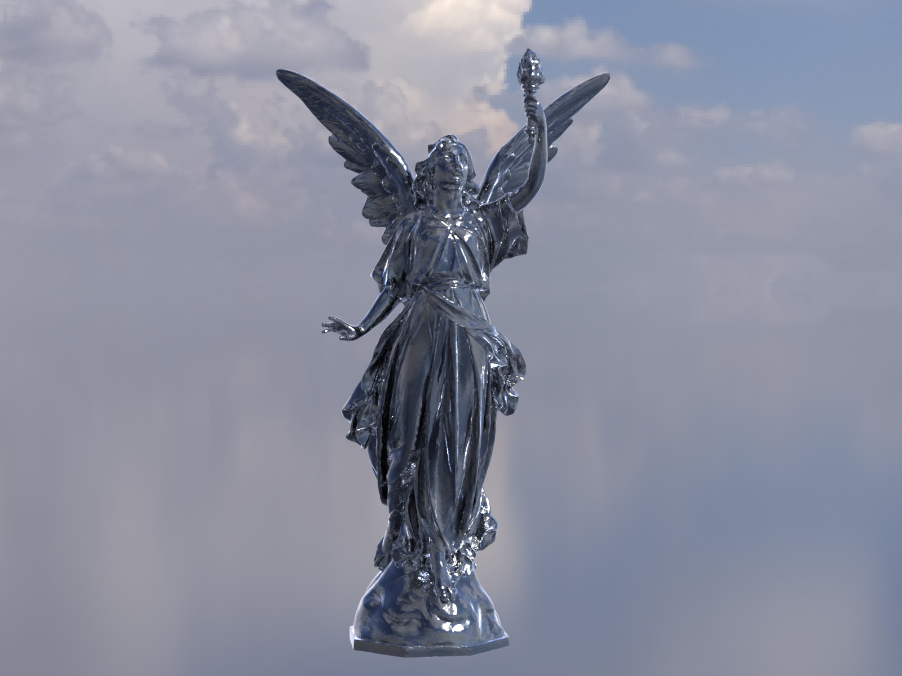 | 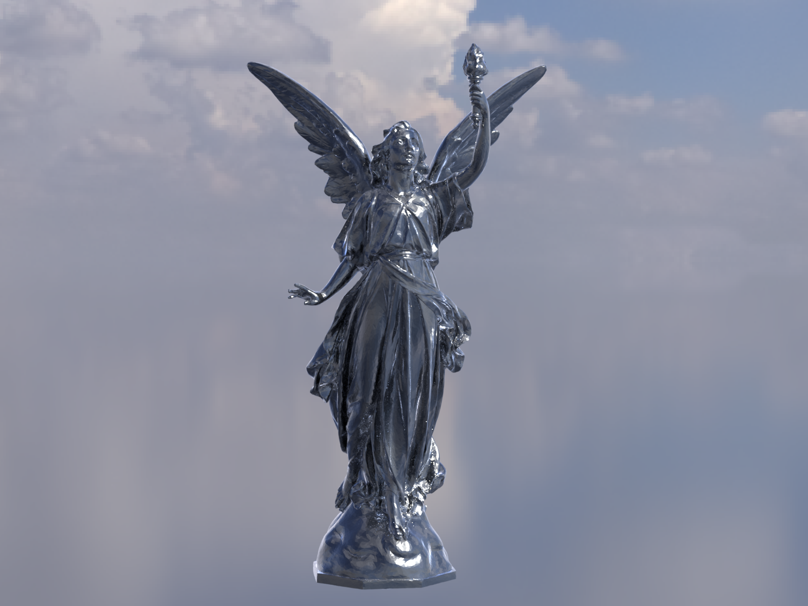 |  |
| 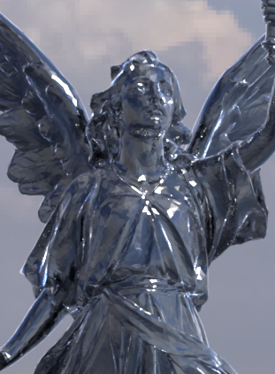 |  | 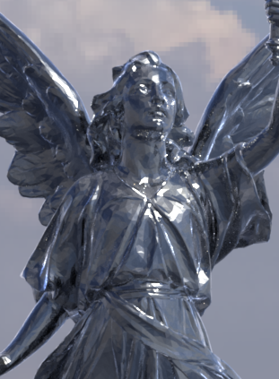 |

<i>Lucy (the statue) with microfacet BRDF (roughness = 0.05), applying different models and sampling method. The second row is the zoomed-in version of a local path in the first row.  Notice how the highlight in the chest differs between Beckmann and GGX. One can also observe slightly less fireflies for GGX with visible normal sampling turned on (recommend to look at images at their full resolution).</i>

We only mentioned microfacet BRDF above, but to consider translucent materials we need a microfacet BSDF as well. [The formula](https://www.pbr-book.org/3ed-2018/Reflection_Models/Microfacet_Models#eq:torrance-sparrow-transmit) changes a bit when it comes to transmission, but the idea is generally the same. Extension from microfacet BRDF to BSDF is similar to going from mirror to dielectric material. With microfacet BSDF implemented, we are now able to express glass with different levels of roughness.

[**Scene File**](scene/xml/material_balls_microfacetTransmission_512spp.xml)

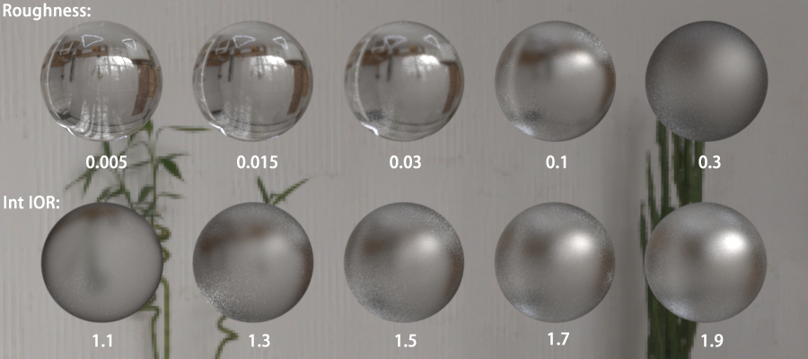

<i>Microfacet BSDF with Beckmann model. Similarly, first row demonstrates varying roughness and second row shows varying interior IOR. Notice the reasonable range of roughness for Microfacet BSDF differs from that of BRDF.</i>

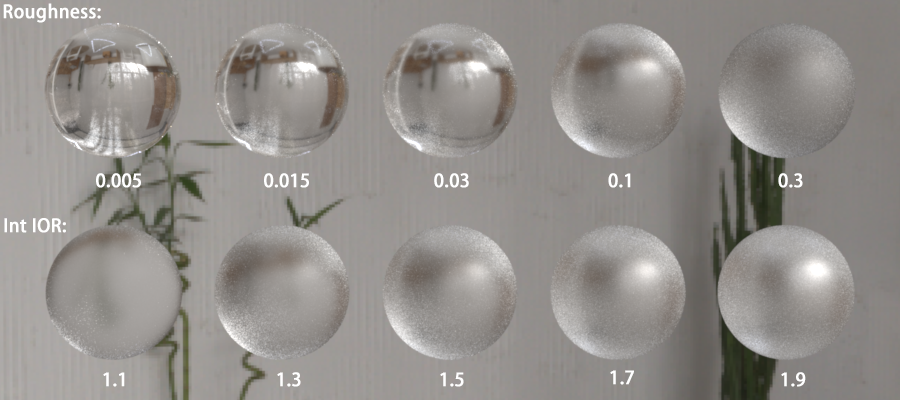

<i>Microfacet BSDF with GGX model. All other parameters are the same as above.</i>

[**Scene File**](scene/xml/cbox_microfacet_transmission_128spp.xml)

| Roughness = 0.1  | Roughness = 0.5  |
| ----------------------- | ------------------- |
| 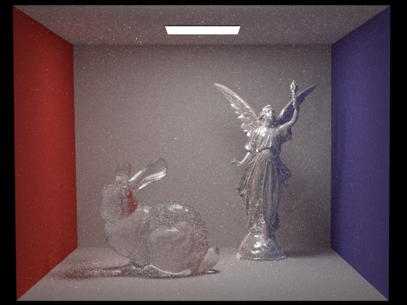 | 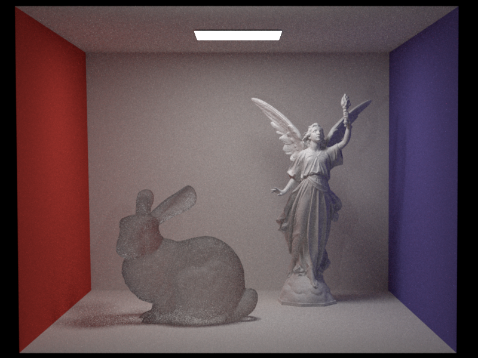 |

<i>Lucy with microfacet BRDF and Bunny with microfacet BSDF.  Both materials with roughness 0.1 / 0.5 on the left / right.</i>

<a name="volume-rendering"/> 

#### Volume Rendering

##### Homogeneous Participating Media
My renderer supports homogeneous participating media filling arbitrary mesh shape. We construct a separate BVH tree for volume mesh intersection.

[**Scene File**](scene/xml/cbox_volpath_homogeneous_512spp.xml)

|  HG (g = -0.5)  | HG (g = 0) / Isotropic | HG (g = 0.5) |
| ----------------------- | ------------------- | ----------------------- |
| 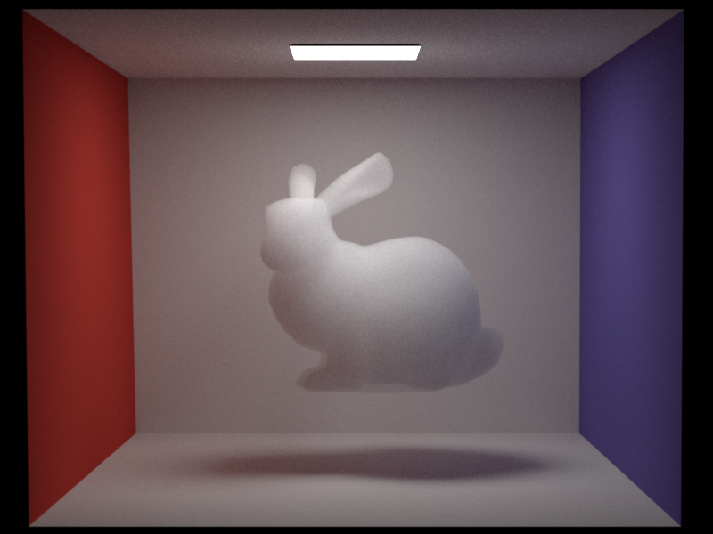 | 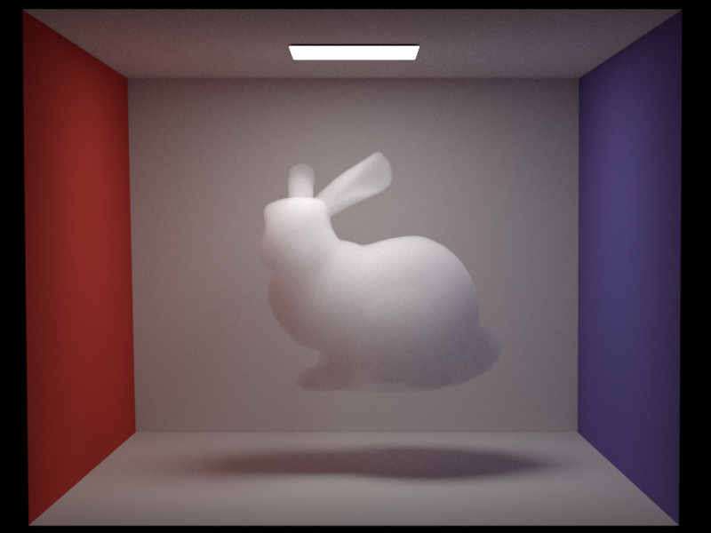 | 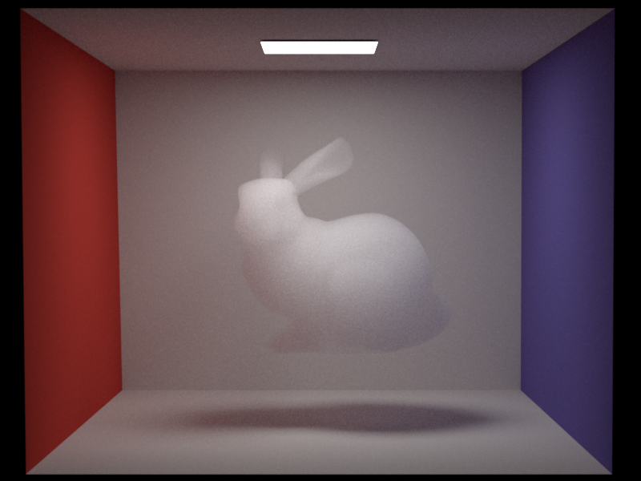 |

<i>Our volume rendering model applies the Henyey-Greenstein phase function.  With different values of parameter g, it demonstrates varying forward (g > 0) or backward (g < 0) scattering characteristics.</i>

##### Heterogeneous Participating Media
My renderer supports rendering heterogeneous participating media from an [OpenVDB](https://www.openvdb.org) file. It requires the user to specify the bounding box to position the medium.

[**Scene File**](scene/xml/cbox_volpath_heterogeneous_128spp.xml)

|  HG (g = -0.5)  | HG (g = 0) / Isotropic | HG (g = 0.5) |
| ----------------------- | ------------------- | ----------------------- |
|  | 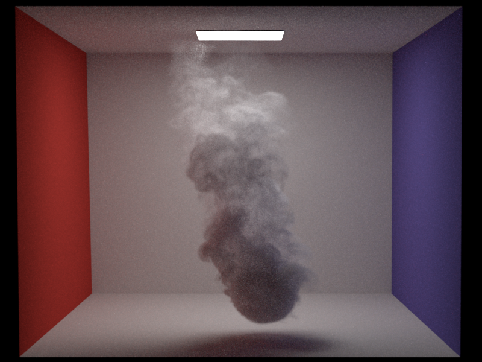 | 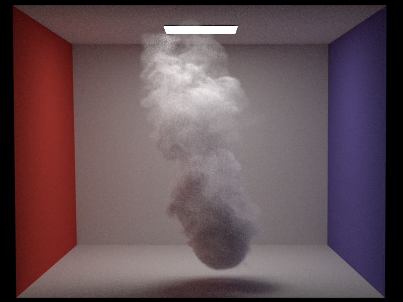 |

##### Transmittance Estimation
When light transmits between two points inside the medium, a part of it is scattered away. [Transmittance](https://en.wikipedia.org/wiki/Transmittance) describes the portion of light that survives. This quantity can be evaluated analytically for homogeneous medium, but needs estimation in the heterogeneous case. In fact, the accuracy of transmittance estimation crucially affects the noise level. As much as sampling light paths matters for rendering equation integral estimation, sampling points to query the medium is the focus of research for better transmittance integral estimation.

I implemented a bunch of transmittance sampling methods, ranging from the simple / classical to the complex / state-of-the-art ones. These methods include:
* Ray Marching (biased, all the rest are unbiased)
* [Delta Tracking](https://www.uni-ulm.de/fileadmin/website_uni_ulm/iui.inst.100/institut/Papers/ugiwpm.pdf)
* [Ratio Tracking](https://cs.dartmouth.edu/wjarosz/publications/novak14residual.html)
* [Next-Flight Estmiator](https://jannovak.info/publications/SDTracking/SDTracking.pdf)
* [Power-series CMF](https://cs.dartmouth.edu/wjarosz/publications/georgiev19integral.html)
* [Unbiased ray marching](https://research.nvidia.com/publication/2021-06_unbiased-ray-marching-transmittance-estimator)
* [Debiasing method](https://cs.dartmouth.edu/wjarosz/publications/misso22unbiased.html)

(I've actually conducted a whole project to analyze and compare between these transmittance estimation techniques, but can't disclose more details due to a signed NDA.)

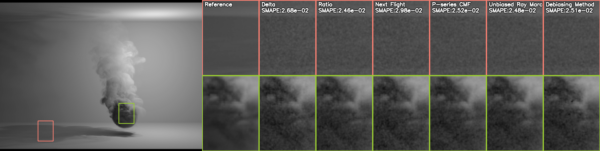

<i>Noise performance of different trackers under the same SPP. In this experiment, the only light source is a point light and maximum path length is limited to two bounces, so as to maximally demonstrate the effect of transmittance accuracy on image noise level. State-of-the-art methods (power-series CMF, unbiased ray marching and debiasing method) exhibit similar noise level, and is generally better than other classical methods. However, the most-performant unbiased ray marching contains much complex sampling and computation and therefore is a lot time-consuming than other methods.</i>

##### Emissive Participating Media
[**Scene File**](scene/xml/cbox_volpath_emission_128spp.xml)

Emissive volume is supported in my renderer. We treat such volume as [blackbody emitters](https://pbr-book.org/3ed-2018/Light_Sources/Light_Emission#BlackbodyEmitters), transforming per-grid temperature value (from OpenVDB file) into radiance. As the computation also involves the wavelength of the light, this functionality is only supported in a physically accurate way under the spectral rendering mode (see next section). One can still render emissive volume in RGB mode, with slight color difference.

| RGB Mode | Spectral Mode (Correct)  |
| ----------------------- | ------------------- |
| 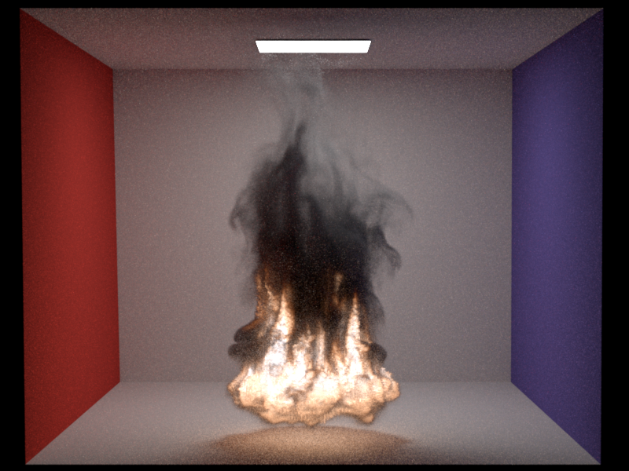 | 

<i>Notice the flame in RGB mode looks slight more pale.</i>

A naive way to sample emissive participating media is to simply record along the light path. Intuitively, if the emission across volume is relatively proportional to medium density, this strategy works fine; however, if the radiance and density distribution are remarkably different, this naive sampling method will lead to heavy noise.

It is clear that some kind of importance sampling is necessary: a direct idea would be to sample the light path endpoint according to 3D volume grid radiance. This is the improvement I implemented in code (see comparison below). However, this is clearly suboptimal as we fail to consider transmittance (as an indication of medium density). For example, we might sample an endpoint with high emission but very much far away; in that case, transmittance between current path vertex and the selected point can be small, leading to a low path contribution. In other words, the optimal endpoint selection distribution varies according to the current path vertex location. A better strategy from [Simon et al.](https://onlinelibrary.wiley.com/doi/10.1111/cgf.13228) constructs endpoint sample probability on-the-fly on a coarser grid. This is left for future work.

| Naive Sampling | Straightforward Importance Sampling  |
| ----------------------- | ------------------- |
|  | 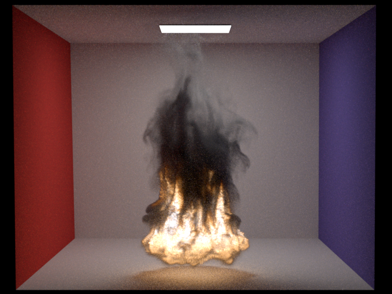

<i>Two emission sampling methods as mentioned above.  In this example, the emissive part of the fire also has high density, so the radiance is sampled well by light paths in the naive method. Importance sampling has no advantage in noise level over it, while being more time-consuming due to additional sampling process.</i>

<a name="spectral-rendering"/> 

#### Spectral Rendering
Traditional RGB mode renders the scene in red, green and blue components. In real world, the light we see is a combination of light waves from different wavelengths across the whole [visible light spectrum](https://en.wikipedia.org/wiki/Visible_spectrum) (380-750 nm). To be more specific, this combination is an integral over the continuous visible light domain, while RGB representation discretizes the quantity with loss of information.

[Spectral rendering](https://en.wikipedia.org/wiki/Spectral_rendering) models the light transport with real wavelength representation, estimating an additional integral over the light spectrum outside the original rendering equation one. This double-integral expression is physically accurate but requires more computation to estimate. Designing efficient data structure and sampling method for wavelength-based quantities is a challenge for modern renderers. Please refer to [PBRT V3 Book](https://pbr-book.org/3ed-2018/Color_and_Radiometry/Spectral_Representation) for more technical details.

The spectral rendering implementation in this renderer mostly refers to the code of [PBRT V3](https://github.com/mmp/pbrt-v3/blob/master/src/core/spectrum.h) and [PBRT V4](https://github.com/mmp/pbrt-v4/blob/master/src/pbrt/util/spectrum.h). PBRT V3 represents spectrum quantities as 60-dim vectors that sample evenly across visible light spectrum (i.e. the wavelength set to sample is pre-determined and static across the program), which is extremely memory-and-computation-inefficient. PBRT V4 stores only object quantities as dense spectrum, while each ray carries around a randomly-sampled 4-channel sparse spectrum; whenever a ray interacts with an object, it samples the corresponding dense quantity with its small wavelength sets. This method achieves better storage and computation usage.

My renderer supports convenient switching between RGB and spectral rendering mode through `CMake option -DNORI_SAMPLED_SPECTRUM=ON/OFF`.

With spectral mode enabled, we are able to set wavelength-dependent index of refraction (IOR) value for dielectric materials and render [dispersion](https://en.wikipedia.org/wiki/Dispersion_(optics)) effect. When a ray intersects such a dielectric object, it should be split into multiple rays toward different directions. In our path tracing algorithm, in order to avoid an exponential growth in the total number of rays, we only keep one ray at intersection, and the channel-specific path PDFs are adjusted (one divided by 4, other three set to 0) to keep final image unbiased.

##### Dispersion with Dielectric Material
[**Scene File**](scene/xml/cbox_path_spectral_512spp.xml)

| RGB | Spectral  |
| ----------------------- | ------------------- |
| 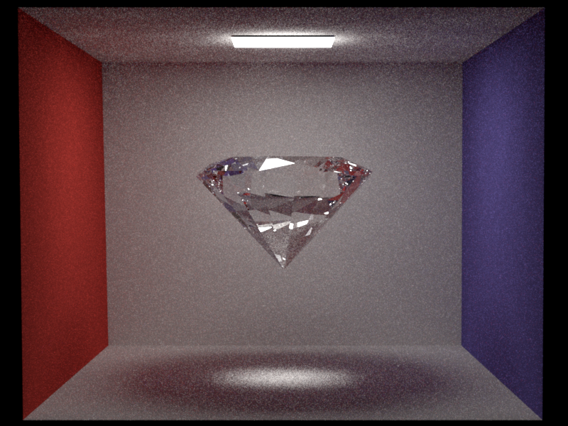 | 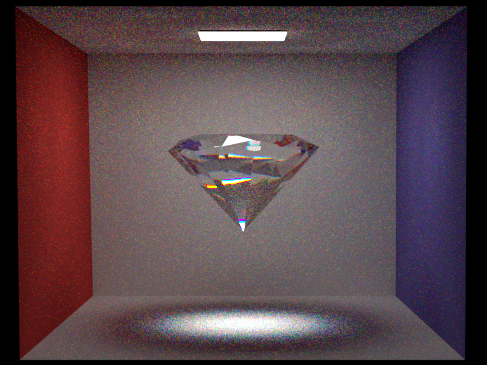

<i>Diamond rendered in RGB and Spectral rendering mode.</i>

##### Dispersion with Rough Dielectric Material (Herowavelength Sampling)

Though we manage to render dispersion, the refracted rays now carry valid radiance value for only one wavelength; this results in color noise. If you observe the spectral image above carefully, the noise looks colorful. A solution to color noise in dispersion is [Herowavelength Sampling](https://cgg.mff.cuni.cz/~wilkie/Website/EGSR_14_files/WNDWH14HWSS.pdf), which samples new light direction with one wavelength (i.e. the herowavelength) and computes the probabilities of other wavelengths taking this direction; the probabilities are then used to importance sample across channels. However, such approach is not feasible for dielectric materials with output distribution being a delta function, as the probabilities of other wavelengths are all 0s. Luckily, we have microfacet BSDF (or rough dielectric) that fits into the herowavelength sampling framework and can be used to generate dispersion effect.

[**Scene File**](scene/cbox_path_spectral_herowavelength_128spp.xml)

| Diamond | Diamond + Sphere  |
| ----------------------- | ------------------- |
| 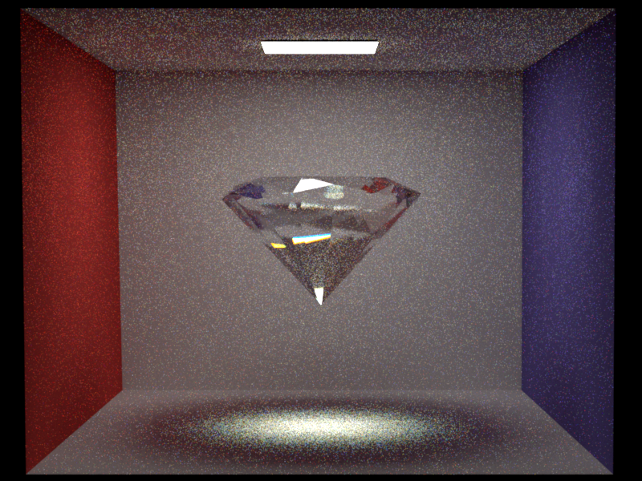 | 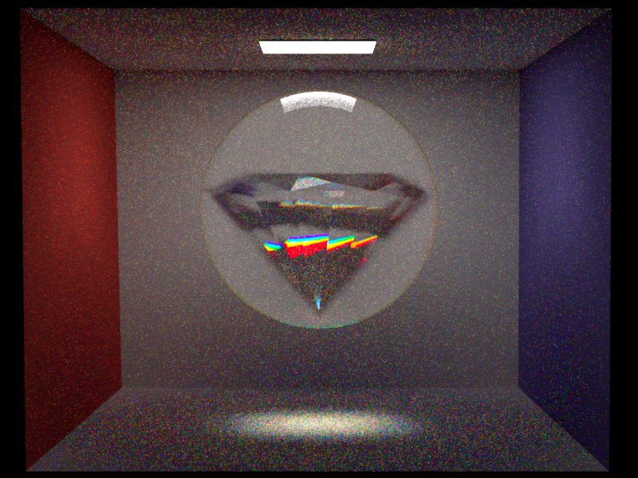 |

<i>Dispersion effect rendered with rough dielectric materials and herowavelength sampling. Notice that in the left image, the noise mostly go back to grayscale.  Color noise still appears when certain light paths are viable for some but not all carried wavelengths, but such phenomenon is limited compared to dielectric materials.</i>

<a name="photon-mapping"/> 

#### Photon Mapping

[Photon mapping](https://en.wikipedia.org/wiki/Photon_mapping) is a two-pass rendering algorithm. The program first emits photons from light into the scene, then shoots camera rays to gather photons and estimate incident radiance; photons and camera rays together form a "connection" from camera to light. Unlike path tracing, the algorithm is biased. Bias is induced by the [kernel density estimation](https://en.wikipedia.org/wiki/Kernel_density_estimation) of photons to yield radiance. Still, photon mapping is consistent, meaning that it would approach the correct result with increasing number of emitted photons.

Photon mapping is especially effective in generating "difficult-to-sample" light paths, such as [caustics](https://en.wikipedia.org/wiki/Caustic_(optics)). Photons are reused across multiple camera rays, making the algorithm computationally efficient. On the other hand, these photons should be stored in memory throughout the second pass, so the memory size limits the maximum number of photons. Another downside is that bias shows up in many forms, such as darker edges, blotchy flat areas and over-blurring. Final gathering is proposed to remedy the blotchy issue: at the point of density estimation, we trace several rays to push the estimation one bounce further and gather all of them. Separating caustics-related photons into an additional caustics photon map to generate sharper caustics is also a common approach, usually combined with final gathering. See result comparisons below.

[Scene file](scene/xml/cbox_photon.xml)

|  Path Tracing  | Naive Photon Mapping | Final Gathering with Caustics Map |
| ----------------------- | ------------------- | ----------------------- |
|  |  |  |
| 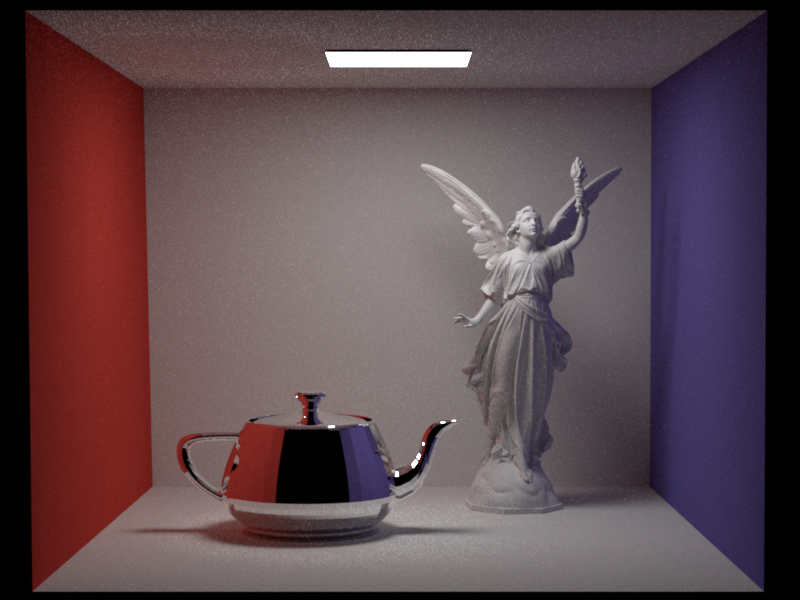 |  | 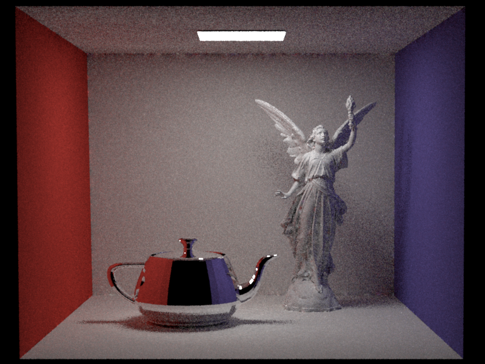 |

<i>Comparison of three algorithms in two scenes. After improving photon mapping with final gathering and caustics map, the blotchy effects disappear.  Path tracing: 512spp; photon mapping: 1,000,000 photons; final gathering and caustics map: 100,000 photons, 5 randomly-shot rays to gather at each diffuse point.</i>

##### Progressive Photon mapping

[Progressive photon mapping](http://graphics.ucsd.edu/~henrik/papers/progressive_photon_mapping/progressive_photon_mapping.pdf) (PPM) is a multi-pass algorithm with a first ray-tracing pass followed by any number of photon-tracing passes. Similar to storing photons in photon mapping, in PPM we store where camera rays hit the scene to be visible points. In each following photon tracing pass, we compute radiance estimate based on photons emitted this iteration. By progressively shrinking the density estimation kernel and aggregating gathered radiance over all iterations, both noise and bias decrease in the final rendered image (i.e. achieve convergence). Final gathering and caustics photon map are not required for PPM to yield satisfying result, so the code is clean and simple.

PPM needs to store not photons but visible points, so the memory issue still exists. To finally circumvent the problem, [stochastic progressive photon mapping](http://graphics.ucsd.edu/~henrik/papers/sppm/stochastic_progressive_photon_mapping.pdf) is proposed. The extension from PPM to SPPM should be straightforward, and is left for future work.

[Scene file](scene/xml/cbox_progressive_photon.xml)

|  Iter = 5  | Iter = 20 | Iter = 50 |
| ----------------------- | ------------------- | ----------------------- |
| 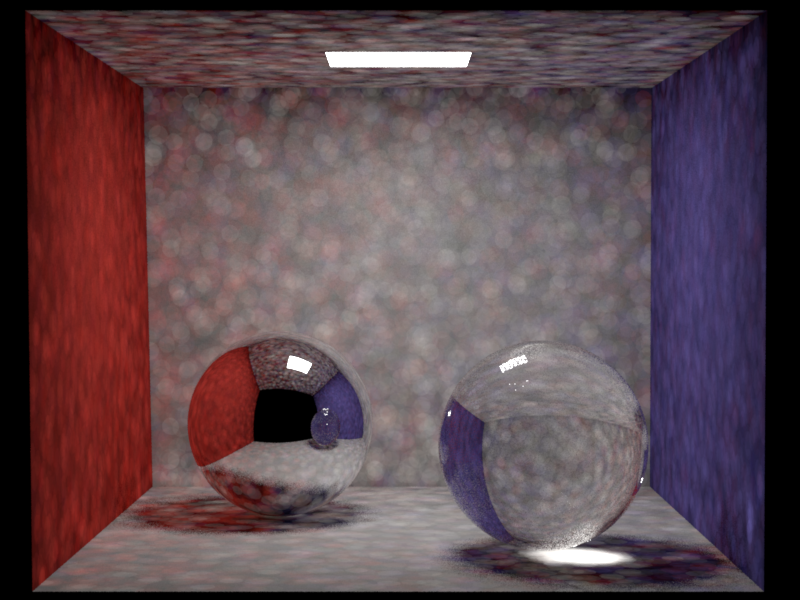 |  | 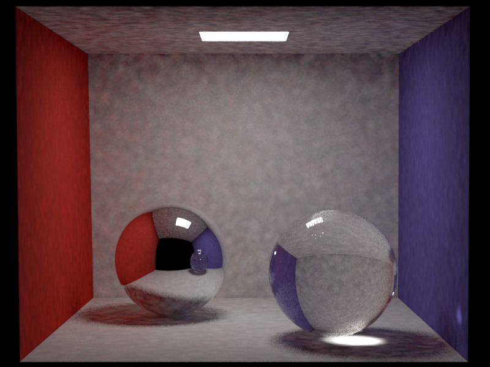 |

<i>Progressive photon mapping with varying numbers of photon-tracing pass.  Each pixel has 16 visible points (i.e 16 spp), and 10,000 photons are emitted in each iteration. Bias diminished with increasing iterations.</i>

|  Photon = 1000 | Photon = 10000 | Photon = 10000 |
| ----------------------- | ------------------- | ----------------------- |
| 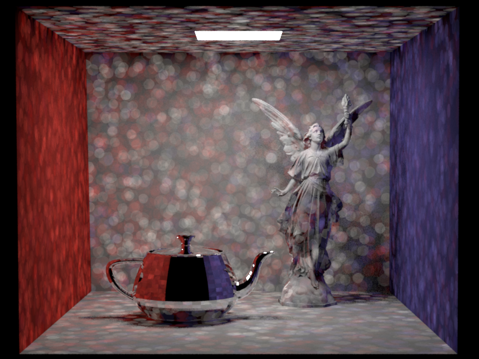 |  |  |

<i>Progressive photon mapping with varying numbers of photons emitted in each pass.  Each pixel has 16 visible points (i.e 16 spp), and the program run 20 iterations. Bias diminished with increasing iterations.</i>

#### Volumetric photon mapping

In order for photon mapping to support rendering volumes, we need to deposit photons on either surface and volume; therefore, one surface photon map and one volume photon map are constructed separately. When a single photon traverse in the scene, it is stored in one of the two maps depending on the current scattering type. The kernel density estimation for surface and volume are similar, except that in the 3D volume structure we need to query photons from the surrounding sphere instead of circle; this leads to the change of denominator in the estimation formula: from $\pi r^2$ to $\frac{4}{3}\pi r^3$. For simplicity, we use naive photon mapping algorithm as the base, so no final gathering or caustics map is applied.

[Scene file](scene/xml/cbox_volphoton.xml)

| Path Tracing | Volumetric Photon Mapping  |
| ----------------------- | ------------------- |
|  | 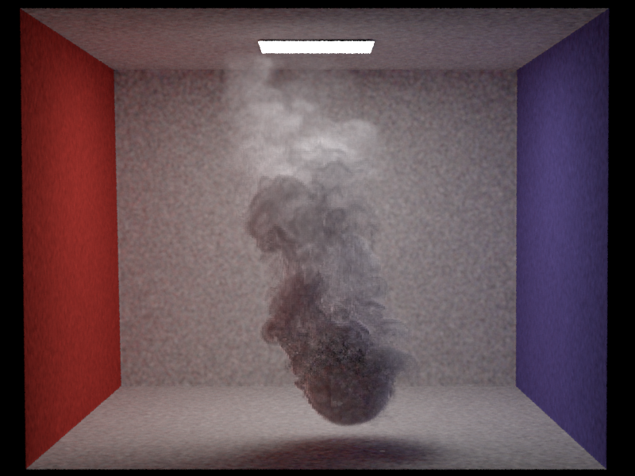 |

<i>Same volume rendered with path tracing vs volumetric photon mapping. Total number of photons used is 10,000,000.</i>

##### Environment map
Photon mapping can render all supported light source types (please refer to the light source subsection). To achieve this, each light type should uniquely define how photons are emitted according to its own characteristics. This is relatively straightforward for finite light types, but involves trick and creativity for infinite ones (directional and environment map light). See `samplePhoton(...)` function inside each light class for details.

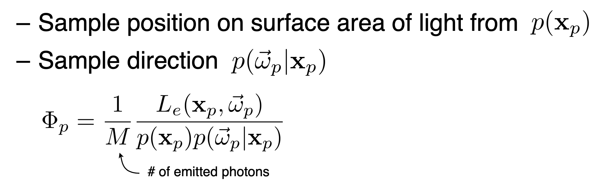

<i>Formula of energy carried by emitted photons.</i>

[Scene file](scene/xml/cbox_photon_envmap.xml)

|  Path Tracing  | Naive Photon Mapping | Photon Mapping with Caustics |
| ----------------------- | ------------------- | ------------------- |
| 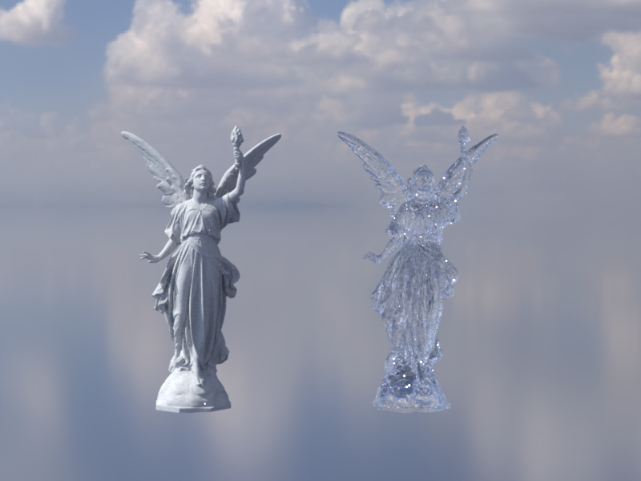 |  |  |

<i>Validate the correctness of environment map light source in photon mapping algorithm.</i>

##### Combination with Spectral Rendering

When it comes to storing photons / visible points under the spectral rendering mode, representing them with dense spectrum would be a hugh burden for memory and is totally unrealistic. Instead, we pre-sample a bunch of wavelength-quadruplets, and build one photon map for each quadruplet to store photons carrying specifically this sparse wavelength (i.e. we trace photons multiple times, one for each set). During the ray tracing pass, we trace one ray for each photon map (i.e. each ray starts at the same origin and direction, but carries corresponding sparse wavelength of the photon map). In other words, we rely on the randomly pre-sampled wavelength-quadruplets to cover evenly over the spectrum, as a substitute for the "idealistic" dense spectrum photon map.

The extension from RGB to spectral mode for photon mapping involves quite some mundane coding and not much technical insight. Currently, photon mapping, progressive photon mapping and volume photon mapping all support spectral rendering mode.

<a name="gallery"/>

## Gallery
**(More scenes to be added soon)**

### War in Snow Globe

This is (a slightly modified version of) the piece submitted to the rendering competition of ETHZ 2022 CG course, given the theme "out of place". It is the collective work between me and [@ZijunH](https://github.com/ZijunH). The presentation video is on [Youtube](https://youtu.be/wtH4PCtMOoY?t=5336).

This image depicts an indoor scene centered on a snow globe with a war scene placed inside. The warm and bright light shining through the globe, as well as the cozy indoor atmosphere, strongly contrasts the bombed building with flames presented inside the glass sphere. It is created to symbolize destruction in peace and appeal to people to resist war.

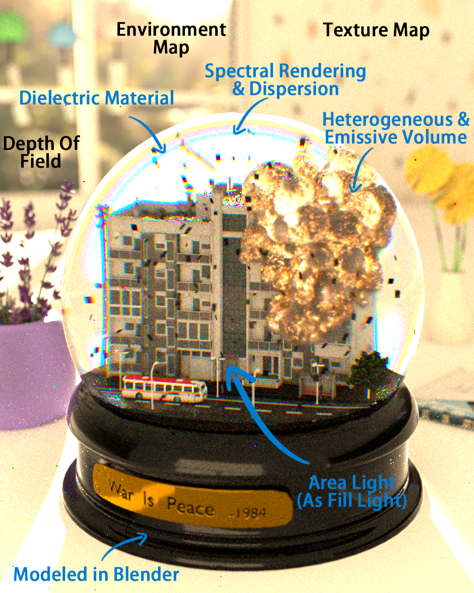

<i>Annotated the techniques showcased by the rendering.</i>

The scene is assembled in Blender and exported as Nori-style XML file through [plugin](https://github.com/Phil26AT/BlenderNoriPlugin). Some meshes are self-modeled, others are from online resources. We provide a side-by-side comparison with the scene rendered by Blender Cycles. Notice that the scene is slightly modified.

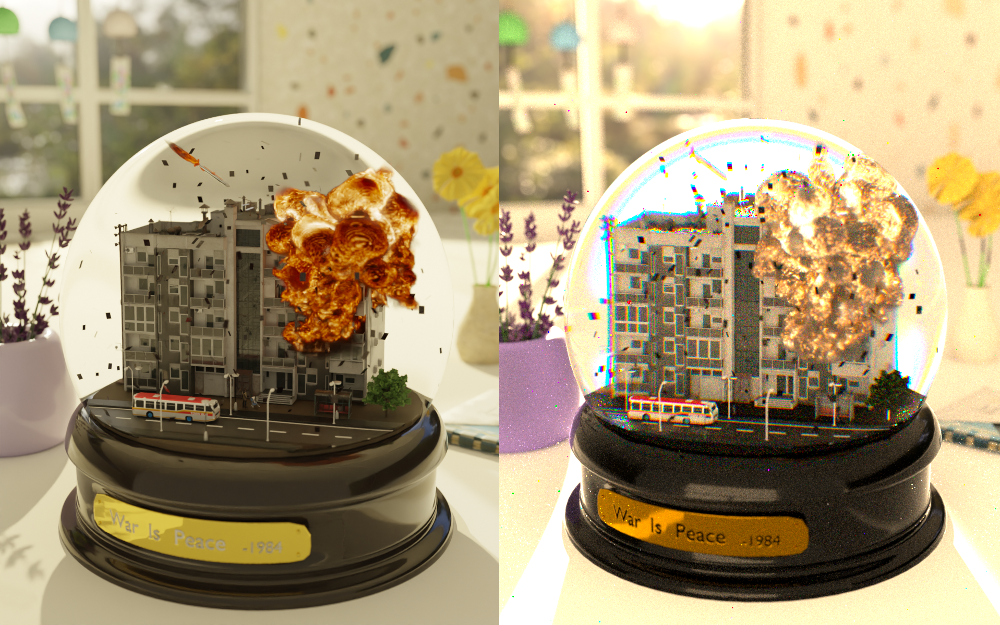

<i>Left: Blender &nbsp;&nbsp;&nbsp;&nbsp; Right: Mine</i>

<a name="install-and-build-instrustions"/>

## Install and Build Instructions

Follow the instructions on [Nori website](https://wjakob.github.io/nori/).

<a name="third-party-credits"/> 

## Third-Party Credits
### Reference

#### Open-Source Renderer
* [Physically Based Rendering, Third Edition](https://pbr-book.org)
* [Physically Based Rendering, Forth Edition](https://github.com/mmp)
* [Mitsuba 3](https://github.com/mitsuba-renderer/mitsuba3)

#### Blog
* [Importance Sampling techniques for GGX with Smith Masking-Shadowing](https://schuttejoe.github.io/post/ggximportancesamplingpart1/)
* [Rendering the Moana Island Scene Part 1: Implementing the Disney BSDF](https://schuttejoe.github.io/post/disneybsdf/)
* [Depth of Field](https://pathtracing.home.blog/depth-of-field/)

#### Paper
* [Hero Wavelength Spectral Sampling](https://cgg.mff.cuni.cz/~wilkie/Website/EGSR_14_files/WNDWH14HWSS.pdf)
* [Sampling the GGX Distribution of Visible Normals](https://jcgt.org/published/0007/04/01/)
* [Integral formulations of volumetric transmittance](https://cs.dartmouth.edu/wjarosz/publications/georgiev19integral.html)
* [An unbiased ray-marching transmittance estimator](https://research.nvidia.com/publication/2021-06_unbiased-ray-marching-transmittance-estimator)
* [Unbiased and consistent rendering using biased estimators](https://cs.dartmouth.edu/wjarosz/publications/misso22unbiased.html)
* [Monte Carlo methods for volumetric light transport simulation](https://cs.dartmouth.edu/wjarosz/publications/novak18monte.html)
* [Progressive Photon Mapping](http://graphics.ucsd.edu/~henrik/papers/progressive_photon_mapping/progressive_photon_mapping.pdf)

### Libraries
* [C++ Image Loader and Writer](https://github.com/nothings/stb)
* [OpenVDB](https://www.openvdb.org)
* [BlenderNoriPlugin](https://github.com/Phil26AT/BlenderNoriPlugin): export Blender scene to XML file as Nori input

### Assets
* Model: [
  common-3d-test-models](https://github.com/alecjacobson/common-3d-test-models), [Sketchfab](https://sketchfab.com)
* Texture: [Poly Haven](https://polyhaven.com)

<a name="todos"/> 

## TODOs

This list is a bit long, as I am really interested and ambitious in implementing existing state-of-the-art algorithms to render different visual effects.

Let me quote the words of Prof. [Lingqi Yan](https://sites.cs.ucsb.edu/~lingqi/) here: **Computer Graphics is AWESOME!**

#### Performance Analysis and Optimization
* Render time is recorded in .exr file, use it to compare between algorithms

#### Bug Fix
* Spectral Rendering + Rough Dielectric material -> crash after running for a few minutes

#### Extension on Existing Algorithms
* Volume rendering
  * Advanced emission sampling
    * [Line Integration for Rendering Heterogeneous Emissive Volumes](https://onlinelibrary.wiley.com/doi/10.1111/cgf.13228)
  * [Null-scattering Path Integral Formulation](https://cs.dartmouth.edu/wjarosz/publications/miller19null.html)
    * Support spectral-varying extinction coefficient
* DOF: support new aperture shape through mask

#### New Functionalities
* BSDF
  * Conductor
  * Disney BSDF
* Subsurface scattering

(Nice to have)
* MipMap for textures
* Stratified sampling
* Equiangular sampling of single scattering
* Denoising

(Hopefully not too ambitions)
* Render atmosphere
* Many light sampling
* Bidirectional path tracing
* Path guiding
* Metropolis Light Transport
